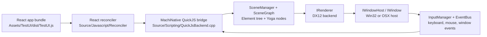

# MachiUI Architecture Notes

Reviewed on 2026-05-15. This note summarizes the architecture observed from the
current source tree, not only the intended design.

## Short Summary

MachiUI is a C++17 native UI engine that embeds QuickJS, runs a React
reconciler bundle, translates React host mutations into a native `Element` tree,
lays that tree out with Yoga, and renders it into OS windows through renderer
backends. The Windows path is the most complete path today: Win32 provides
windows and input events, while the DX12 backend renders rectangles and text.

## Repository Layout

- `Source/Core/`: engine services, service registry/provider, scene graph,
  element base type, input/event bus, view/window mapping, timers, logging,
  native view slots, and host action registry.
- `Source/Elements/`: built-in element classes registered by `ElementFactory`
  (`div`, `img`, `text`, `button`, `span`, `native-view`, `Root`).
- `Source/Scripting/`: QuickJS embedding and the C++ functions exposed to JS as
  `MachiNative`.
- `Source/Javascript/`: TypeScript React reconciler, DOM compatibility shim,
  utility-style resolver, and React DOM compatibility facade.
- `Source/Renderer/`: renderer interface, render queue primitives, and backend
  implementations. The active Windows backend is `Renderer/Backend/DX12`.
- `Source/MinimalPlatform/`: OS window hosts. Win32 is used on Windows; OSX
  files exist for Apple builds.
- `Assets/TestUI/`: webpack-built example React UI that imports the Machi
  reconciler sources and produces `dist/TestUI.js`.
- `Test/UnitTest/`: GoogleTest targets for Core, Scripting, Renderer, and
  selected runtime integration behavior.
- `ThirdParty/`: vendored `yoga`, `quickjs`, `spdlog`, and `boost-di` header
  dependency.

## Build Shape

Top-level `CMakeLists.txt` builds `MachiUi` as a static library from
`MachiUi_OBJECT`, links Yoga, QuickJS, spdlog, platform libraries, and creates
the `test2` executable from `examples/main_windowmanager.cpp`.

Important build switches:

- `STANDALONE_MODE`: when true, platform window host sources are included in
  the engine build.
- `DEFAULT_LOGGER`: when true, spdlog is added and used by the default logger.
- `BUILD_TEST`: enables `Test/` and the GoogleTest executables.

The build also copies `Source/Javascript/dist` into `assets/platform` next to
the executable and symlinks/copies runtime assets for `test2`.

## Service System

Most engine subsystems derive from `IService`.

- `ServiceRegistry` is a Meyers singleton populated through static registration
  macros such as `REGISTER_UI_COMPONENT` and `REGISTER_UI_COMPONENT_AS`.
- `ServiceInitializer::createAllServices` instantiates services by phase:
  `System`, `Logic`, then `Render`.
- `ServiceProvider` owns service instances in a `type_index` map and is the
  lookup mechanism used during `onInit`.
- `IService::initialize` guards each service so `onInit` runs once.

Currently registered core services include:

- System: `LogManager`, `DefaultTimer` as `ITimer`, `DefaultFileLoader` as
  `IFIleLoader`, `ElementFactory`, `EventBus`, `InputManager`, `SceneManager`,
  and platform `IWindowHost`.
- Logic: `ScriptManager`, `ViewManager`, `TaskScheduler`, `ActionRegistry`,
  and `NativeViewRegistry`.
- Render: `Dx12RendererImpl` as `IRenderer` on Windows.

## Engine Lifecycle

`UiEngine::Init` is the main bootstrap:

1. Creates a `ServiceProvider`.
2. Instantiates all statically registered services.
3. Calls each service's `onInit` for dependency lookup.
4. Ensures default input channels exist.
5. Caches fundamental services (`IWindowHost`, `ITimer`, `SceneManager`,
   `ScriptManager`, `ViewManager`, `IRenderer`).

`UiEngine::Run` is the standalone loop:

1. Mounts `assets/TestUI/dist/TestUI.js` if no default root exists.
2. Requests/shows a native window through `ViewManager` or `IWindowHost`.
3. Ticks the timer.
4. Calls `update(deltaTime)`.
5. Processes reserved scheduler work.

`UiEngine::update` currently performs:

1. `windowHost->update()` to pump OS messages.
2. `scriptManager->Update()`; this is currently mostly empty.
3. `_updateLayout()`; this is currently empty.
4. `renderer->execute()`; on DX12 this is where Yoga layout and drawing happen.

## Scene And Elements

`SceneManager` owns all scene graphs and all elements:

- Scene graph IDs and element IDs come from the same monotonically increasing
  counter.
- `sceneGraphMap` stores `SceneGraph` objects.
- `objectPool` stores `Element` instances by UID.
- `createRoot` creates a `Root` element and attaches it to a `SceneGraph`.
- `AppendElement`, `InsertElementBefore`, `RemoveElement`, and
  `destroyAllChildren` mutate parent-child relationships and Yoga child nodes.
- `updateAttribute` forwards props/styles to `Element::ApplyAttributes` and
  marks the element dirty.

`Element` is the native DOM-like node:

- Each element owns a Yoga `YGNodeRef`.
- It stores `id`, `text`, `src`, `visible`, arbitrary attributes, parent, and
  raw child pointers.
- Style-like keys such as `width`, `height`, `flexDirection`, `margin`,
  `padding`, `gap`, and `display` are applied directly to Yoga.
- Known attributes such as `text`, `id`, `src`, and `visible` update dedicated
  fields; unknown props are retained in the attribute map for renderer/runtime
  use.
- `TextElement` installs a Yoga measure function based on text length, font
  size, and line height.

## JavaScript Runtime

`ScriptManager` owns the QuickJS runtime/context through `ScriptManager::Impl`.
It registers:

- a CommonJS-like/global `console.log`;
- a module loader using `IFIleLoader::readFile`;
- path normalization through `IFIleLoader::resolvePath`;
- the `MachiNative` global object.

`MachiNative` exposes the native bridge:

- tree operations: `createRoot`, `createElement`, `createTextNode`,
  `appendChild`, `insertBefore`, `removeChild`, `clearChildren`;
- props/text: `updateProps`, `updateText`, `getBoundingClientRect`;
- events: `updateEventHandler`, `updateGlobalEventHandler`;
- host capabilities: `isNetworkEnabled`, `fetchSync`;
- host actions: `invokeAction`.

`ScriptExecutionContext` carries the active default scene graph while a module
is being evaluated. `UiEngine::mountScriptView` creates a view, creates a scene
graph/root, attaches the scene to the renderer, then executes the JS module with
that graph as the active root.

Network support is intentionally disabled by default. `ScriptManager` has
`setNetworkEnabled`, and QuickJS installs `fetch`, `Request`, `Response`,
`Headers`, and `MachiRuntime.hasCapability("network")` around the native
capability flag.

## React Reconciler Layer

`Source/Javascript/Reconciler/HostConfig.ts` is the React host config.

- `createInstance` calls `MachiNative.createElement`.
- `createTextInstance` calls `MachiNative.createTextNode`.
- Mutation methods map React operations to `appendChild`, `insertBefore`,
  `removeChild`, and `clearChildren`.
- Renderable props are flattened from `className` and `style` before calling
  `MachiNative.updateProps`.
- `onXxx` props are registered through `MachiNative.updateEventHandler`.
- `createRoot` either uses an existing native root pointer or asks
  `MachiNative.createRoot` for a root element.

`DomShim.ts` provides a lightweight DOM compatibility surface for React-oriented
code: document/body nodes, event listeners, classList, bounding rects,
MutationObserver/ResizeObserver shells, timer helpers, focus-like methods, and
event dispatch plumbing. It is not a browser DOM; it is a compatibility layer
for UI code that can map onto native rendering.

`StyleSheet.ts` resolves registered CSS class rules and a small utility-class
subset into renderable style props.

`ReactDomCompat.ts` maps common `react-dom` and `react-dom/client` entry points
onto the Machi renderer so external code can use familiar React APIs.

## Input And Event Flow

On Windows, `Win32WindowHost::update` pumps messages with `PeekMessage`.
`WndProc` translates keyboard, mouse, wheel, resize, focus, and close messages
into `KeyEvent`, `MouseEvent`, `MouseWheelEvent`, and `WindowEvent`.

`InputManager` publishes those messages into `EventBus` channels:

- `DefaultInputChannel` for pointer, mouse, keyboard, and wheel input.
- `WindowEventChannel` for resize/focus/close events.

QuickJS subscribes lazily when event handlers are registered. The event runtime
does hit testing against the native element tree, dispatches React-style
handlers such as `onClick`, `onPointerDown`, `onDrag`, `onKeyDown`, and also
supports global DOM-like handlers through `document`/`window` shims.

Native views get first-class input routing through `NativeViewRegistry`, which
can capture pointer input, focus a native slot, and dispatch local coordinates
to an `INativeViewAdapter`.

## Rendering

`IRenderer` is the service interface for renderers. It can receive render
commands, attach scene graphs to views, and execute a frame.

The current Windows DX12 backend:

- initializes D3D12 device, queue, fence, swapchain/window contexts, and a
  simple solid-color pipeline;
- initializes D3D11-on-12, D2D, and DirectWrite for text overlays;
- maps scene graph IDs to `ViewId`s with `attachScene`;
- for each attached scene, obtains the native `HWND` from `ViewManager`;
- sets the Yoga root size to the window client size;
- calls `YGNodeCalculateLayout`;
- recursively collects rectangle vertices, text draw commands, and native view
  slots from the element tree;
- synchronizes `NativeViewRegistry` slots;
- renders solid geometry with DX12 and text overlays with D2D/DirectWrite.

The generic `RenderQueue` exists, but the DX12 path mostly renders from the
current `SceneGraph` state rather than relying on queued commands.

## Native Views And Host Actions

Two host-extension points are visible:

- `NativeViewRegistry`: JS can render `<native-view nativeViewType="...">`.
  The renderer reports layout slots every frame; registered native factories can
  mount/update/unmount adapters and receive input.
- `ActionRegistry`: native code can register named actions. JS calls
  `Machi.actions.invoke` / `invokeSync`, which bridge to
  `MachiNative.invokeAction`.

These APIs are useful for embedding platform-native controls, editor/game
views, or imperative host functionality without putting everything into the
React element tree.

## Current Implementation Notes

- The Windows runtime path is the primary implemented path. The Metal backend
  file appears stale relative to the current `IRenderer` signature, and the
  NULL backend is empty.
- Layout is currently computed inside the DX12 renderer's frame execution, not
  in `UiEngine::_updateLayout`.
- `ScriptManager::Update`, `TaskScheduler::processReservedTask`, and periodic
  task scheduling are mostly placeholders.
- `SceneManager::dirtyElementLists` is populated but not yet used to drive
  incremental layout or rendering.
- `SceneManager::isMounted` currently returns true unconditionally.
- `ViewManager` creates at most one Win32 window through `Win32WindowHost`
  because `requestWindow` returns the existing pooled window after the first
  creation.
- Generated artifacts and dependencies are present in-tree (`build`,
  `node_modules`, `Source/Javascript/dist`, `Assets/TestUI/dist`), but normal
  development should avoid committing generated output unless intentionally
  updating runtime bundles.

## Practical Change Points

- Add a new element type in `Source/Elements`, then register it in
  `ElementFactory::onInit` / `initializeBasicElements`.
- Add a new style prop by extending `styleMap` in `Source/Core/Element.cpp`;
  add a JS utility mapping in `StyleSheet.ts` if class-based usage is needed.
- Add a JS-visible native capability in `QuickJsBackend.cpp` by registering a
  new `MachiNative` function and adding TypeScript declarations in
  `Source/Javascript/Native/native.d.ts`.
- Add native host operations through `ActionRegistry` when the operation should
  be named and invoked from JS.
- Add platform-native embedded content through `NativeViewRegistry` and the
  `<NativeView type="...">` wrapper in `NativeHost.ts`.
- Add or replace renderer behavior by implementing `IRenderer` and registering
  it as the render-phase service for the target platform.

